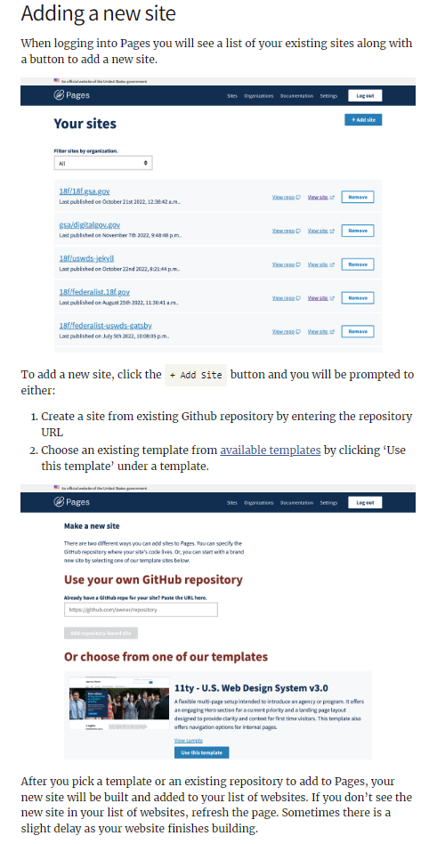

# CG-Pages - Configuration Management Plan (CMP)

## Document Revision History
                                                                        
| Date | Version | Description | Author |
| -------- | -------- | -------- | -------- |
| 06/17/2024 | 1.0 | Initial Document | Pages Compliance Lead |

## Overview
Cloud.gov Pages utilizes agile development methodologies. This Configuration Management Plan (CMP) outlines the configuration management process for the application and its related documentation, managed by the CG-Pages team. It serves as a guideline, describing the procedures for making changes to the application, and the system's functional attributes in relation to requirements, design, and operational maintenance throughout its lifecycle.

## Purpose
The purpose of this Configuration Management Plan (CMP) is to establish a framework for managing the configuration of CG-Pages, a Software as a Service (SaaS) application leveraging the cloud.gov Platform as a Service (PaaS). The cloud.gov Pages Configuration Management (CM) Plan documents the workflows, test, and change management process standard.

## Scope
This CMP applies to all configuration items (CIs) related to CG-Pages, including software components, documentation, and any related artifacts managed within the cloud.gov environment.

## Application Description
Cloud.gov Pages is Software as a Service (SaaS) providing for self-service publishing and maintenance of static web pages. Users are provided with customizable templates for common website use cases. CG-Pages is hosted on the cloud.gov Platform as a Service (PaaS) and leverages the cloud.gov Agency FedRAMP ATO to provide user sites in an S3 bucket brokered by cloud.gov. CG-Pages inherits a portion of the operational challenges as cloud.gov operates, manages, and controls portions or all of the platform components ranging from the Virtual Private Cloud (VPC) and Infrastructure Services.

## Configuration Management Roles and Responsibilities

| Roles | Responsibilities | 
| -------- | -------- |
| Pages Operator (Personnel) | Deploys changes to the development, staging, and production environment via Concourse CI configurations stored in source code; Monitors the system for issues pre & post-deployment; Adds and removes Pages Support; Add and Remove Pages Orgs and Pages Org Managers. |
| Cloud Compliance (Personnel) | Verify compliance and functionality that changes do not introduce new issues; Administrative access to security and compliance. |
| Change Control Board (CCB) | Delegated to Pages Team at the application level and Pages Website Managers at the website level. Reviews and approves change requests and PRs. Ensures that changes do not negatively impact the system. Maintains a record of decisions and changes. |
| Pages Support (Personnel) | Add Pages Orgs; Add and remove Pages Org Managers; Read, write, but no delete access in the Pages applications. |
| Pages Org Manager (Customer) | Manage Org Users, Add Org Site, Remove Org Site; Manage Site Configuration; View Site Build Logs; Audit deployed files. ||        
| Pages Org User (Customer) | Add Org Site, Remove Org Site; Manage Site Configuration; View Site Build Logs; Audit deployed files. |      
| Content Contributors (Customer) | Customer’s Version Control System (VCS) e.g., GitHub; Write access to GitHub and Site Content; View Build Logs; Audit deployed files. No access to Cloud.gov Pages application. | 

## Configuration Identification (CI)
Cloud.gov Pages relies on Cloud.gov Ops for ensuring Concourse, GitHub, Amazon Web Services (AWS), the CloudFoundry organization, and other resources are available to implement the technical aspects of the plan.
https://github.com/cloud-gov/internal-docs/blob/main/docs/resources/Plans-and-Procedures/configuration-management.md.

Pages Org Managers and Pages Org Users are responsible for maintaining the site inventory within their Pages organizations and the repos in their VCS. Configuration of the dependencies is managed as either a package.json (Node.js/JavaScript) or Gemfile (Ruby), which declare the required dependencies for the site. Customer site source code is stored in the VCS (e.g., GitHub) and static code scanning tools can be enabled against the source code. Also, Pages provides automated site scans for deployed Pages sites that check for vulnerabilities via ZAP scan. Pages Org Managers and Pages Org Users are responsible for reviewing and mitigating the findings and upgrading to a non-vulnerable version.
Site content is versioned using VCS. Pages Org Managers designate a git branch in their Cloud.gov Pages site configuration to deploy the demo and/or production website.

## Configuration Item Identification

### Core Processes:
Proxy (NGINX)
Pages Web Application (Node.js)
Pages Worker (Node.js)
Control Plane (CloudFoundry Task)
  - Pages Build Container (Docker)
  - Pages Build Task Containers (Docker)

### Databases:
AWS RDS Postgres
AWS S3 (Object Store)

### Key-Value Store:
AWS Elasticache Redis

### Source Control:
Source Control (GitHub)

### Network and Communication:
HTTPS (HTTP/443) for various authenticated communications
TLS Port 6379 for site build event jobs and build data queue
TLS Port 5432 for site build logs and records

### Pages Websites (Customer):
Static Site framework: Jekyll, Hugo, 11ty, Other
Programming language: Ruby, JavaScript, Python
3rd-party-integrations: GovDelivery, Search.gov, DAP, Other
Plugins: NetlifyCMS

### Examples of Testing Suites for Customer Sites:

#### Available in GitHub
- CodeQL
- Dependabot
- Checkov (DNS Terraform)
- Terrascan (DNS Terraform)
- Custom Github Action

#### Available in Pages
- Zap Security Scans
- Axe Core Accessibility Scans

All changes must be reflected in the customer's VCS versioning.

## Configuration Documentation
CG-Pages maintains close operational alignment with cloud.gov and other parts of TTS and follows the TTS requirements for using GitHub.

### Cloud.gov Pages Ops:
Relies on Cloud Ops for ensuring Concourse, GitHub, AWS, CloudFoundry, and other resources are correctly set up to implement the technical aspects of the plan.
Ensures team-specific implementations for Concourse, GitHub, CloudFoundry spaces, CloudFoundry apps, CloudFoundry services, and other resources are correctly managed in the technical aspects of the plan.
Reviews the plan in our quarterly Security Policy and Account Review meetings.

### Configuration Baseline Management

### Initial Baseline:
The initial baseline was established during the initial release of CG-Pages, capturing the state of all CIs.

### Baseline Updates:
The baseline will be updated with each approved change, ensuring an accurate and current representation of the system.
All configuration items are managed in code and documented in a markdown file CHANGELOG.md https://github.com/cloud-gov/pages-core/blob/main/CHANGELOG.md.

## Change Management

### Change Control
Change Flow Process (Change to the application, adding/removing site)

### Change to CG-Pages application

#### 1 Initiation
Changes are initiated and discussed following the steps in our Story Lifecycle.

#### 2 Issue Creation 
An issue is created describing the issue and outlining the acceptance criteria for completion.

#### 3 PR Creation 
In the appropriate GitHub repository for the component, a PR against the main branch is created that addresses the change. Note that sometimes this branch is called 'main'; other times, it is not, so be sure to check.

#### 4 Automated Checks
If the repository contains cloud.gov-developed code, the PR must have automated checks in GitHub Actions or Concourse, which must pass before the PR can be merged.

#### 5 Review and Approval
The PR is reviewed by someone other than the committer. Pairing via screen-sharing is encouraged and qualifies as a review. The review should include an assessment of architectural design, security, and code quality. The reviewer approves the PR via GitHub.

#### 6 Merging
The committer merges the approved PR. Further updates to an approved PR invalidate the approval. The committer may merge an approved PR if the changes made are time-sensitive.

#### 7 Continuous Integration/Continuous Deployment (CI/CD)
A continuous integration server handles automated tests and continuous deployment (CD) of the merged changes.

#### 8 Testing Environment
All changes are deployed to two separate testing environments: development and staging.

#### 9 Automated Tests
Any and all automated tests are run.

#### 10 Dependency Audit
Dependencies are audited for security vulnerabilities, no critical/high vulnerabilities are allowed to be merged. Other vulnerabilities are handled via a quarterly review process documented here: https://github.com/cloud-gov/internal-docs/blob/main/docs/runbooks/Pages/dependabot-security.md

#### 11 Production Deployment
If all tests pass, changes can be promoted for deployment to production in the pipeline.

### Adding site to CG-Pages
Technical process: A cloud.gov Pages Customer interacts with the Pages Web Application through the web browsers using HTTPS (port 443). The Pages Web Application integrates with the customer's version control system (VCS) (e.g., GitHub) for source code management. The build process involves fetching source code from the customer's VCS (e.g., GitHub) repositories using HTTPS (port 443) with token-based authentication. After fetching source code, Docker image will run to build the customer site source code and then publish the built site pages to AWS S3 via HTTPS (port 443) and send a status back to the Pages Web Application via HTTPS (port 443). The website name is added to the site inventory worksheet upon completion of the site deployment.

### Step by step instructions on how CG-Pages Customers add sites.

- #### Adding a new site link: 
https://cloud.gov/pages/documentation/#adding-a-new-site

- #### Screenshot showing step by step instructions how customers can add sites to CG Pages.

### Site removal from CG-Pages
Changes to websites are conducted at the site level under the direction of the Website Managers.

Pages Org Managers have the ability to remove a site from their Pages organization. If a Pages organization site has a custom domain associated with the site, a Pages Org Manager must request Pages support to remove the site’s custom domain where a Pages Operator will deprovision the custom domain before allowing the Pages Org Manager to remove the site. Requiring a Pages Org Manager to request the deletion of a site’s custom domain is an additional layer to verify the custom domain deletion and avoid unnecessary site downtime.

Pages Operators will only remove sites from customer organizations after a customer agreement has expired without renewal. This is a part of the Pages organization decommissioning.

## Pull Request Process in GitHub
A developer creates a PR for a proposed change.
The PR is reviewed by peers and the CCB.
The CCB evaluates the PR for feasibility, risk, and impact.
Approved PRs are merged into the main branch.

## Configuration Status Accounting
Configuration Status Accounting (CSA) is the process of recording, storing, maintaining, coordinating, and reporting the information necessary for the CM performance and the status of its associated CIs. All software and related documentation are tracked from initial development to request for change, through the [dis]approval of changes, to the implementation of changes. GitHub retains records of all changes made by the CG-Pages team teams. CHANGELOG.md. https://github.com/cloud-gov/pages-core/blob/main/CHANGELOG.md

## Build and Release Management
Dedicated to the release of an executable version of a software product, this CM activity orchestrates the complex assembly, verification, and packaging processes that produce the executable. To achieve this, the correct baseline, composed of baseline versions of CIs, is compiled (built) into an executable. Since the executable represents the only true record of what development delivers to customers, build and release management provides the essential link between development output and what is ultimately deployed into production.
Once an executable is created, it should be delivered for testing or distribution to the customer. Specific build instructions are needed to guarantee that the build steps are taken and that they are performed in the correct sequence. Sometimes different versions of the same product should be built (for platform, customer, functionality, etc.).

## Libraries
Documentation updates may include an entirely new version of the document or an updated section, table, or diagram. In the case of an updated section, table, or diagram, the update must contain the proper section/figure/table number and labeling. CG-Pages team ensures that the documentation is correctly updated and tracked by filling it in the appropriate location (GitHub and G-Drive).

## Automated Tools
The application provisioning code is run through automated unit testing in GitHub. All tests must pass before code can advance in the development lifecycle (using the application's repository’s staging branch, which is then automatically deployed to the staging environment). Next, code is merged to the master branch and automatically deployed to the Production environment. Code changes may include new features, security fixes, or improvements on existing features, and tests are written as needed for new features in the code or bugs.

## Version Control
All changes must be reflected in GitHub. As an agile team, all development cycles are incremental.

## Build Management
To ensure continuity and reduce the risk of loss of work, all developers check their code into GitHub as Pull Requests. As such, the entirety of the codebase is discoverable at any time and all changes are tracked on a change-by-change basis. All code is versioned via GitHub, including application code, tests, builds, and deployment automations. Continuous Integration is performed by Concourse, and all Pull Requests are reviewed under an enforced peer.

## Review and Audits

### Configuration Audits
Audits will be conducted regularly to ensure compliance with the CMP and verify the accuracy of CIs.

### Audit Procedures
Audit procedures will include reviews of CI documentation, status accounting records, and change implementation.

## Review Frequency
All baseline operational components (including the support documentation) are subject to a final review (i.e., Users’ Manual, Operations Manual, etc.) for conformance to the initial design. An initial review for the baseline operational components outlined in the Configuration Management Baseline section was conducted and approved during the CG-Pages Authority to Operate (ATO) documentation process. Ongoing reviews will be conducted on an annual basis or as required due to significant changes to the application.

## Appendices
- ### Glossary of Terms
Configuration Item (CI): Any component that needs to be managed to deliver an IT service.
Change Request (CR): A formal proposal for a modification to a system or product.
Pull Request (PR): A method of submitting contributions to a software project using version control systems such as GitHub.

## Acronyms
CG-Pages: Cloud.gov Pages
VCS: Version Control System
CMP: Configuration Management Plan
CI: Configuration Item
CM: Configuration Management
CCB: Change Control Board
CI/CD: Continuous Integration/Continuous Deployment
PR: Pull Request
ATO: Authority to Operate
CR: Change Request
G-Drive: Google Drive
CSA: Configuration Status Accounting
AWS: Amazon Web Services

## References:
cloud.gov Documentation: https://cloud.gov/docs/
cloud.gov Configuration management:
https://github.com/cloud-gov/internal-docs/blob/main/docs/resources/Plans-and-Procedures/configuration-management.md
NIST SP 800-128, Guide for Security-Focused Configuration Management of Information Systems https://nvlpubs.nist.gov/nistpubs/Legacy/SP/nistspecialpublication800-128.pdf

This Configuration Management Plan ensures that CG-Pages remains reliable, secure, and compliant while leveraging the cloud.gov platform. For any questions or further information, please contact CG-Pages Team at pages-support@cloud.gov.

