Invite a new user to Pages flow
===============================

A flowchart depicting the user invite flow when an org manger is inviting a new member to the org.

```mermaid
flowchart TB
    subgraph View my Organization memberships
        orgs_page["`
            __/organizations__ 
            Shows the list of the organizations that the current user has a User or Member role for
        `"]
        style orgs_page stroke:#167CC5,stroke-width:8px
    end

    orgs_page --> org_page

    subgraph View an Organization's details
        org_page["`
            __/organization-slug/{org-id}__ 
            Lists Users and Managers for the current organization
        `"]
        style org_page stroke:#167CC5,stroke-width:8px
    end

    org_page --> email_input
    org_page --> role_input

    subgraph Add User/Member to this Org
        subgraph Invite User Form
            email_input["`Email address for new User/Member _(Required) Used to authorize via UAA_`"]
            style email_input stroke:#167CC5,stroke-width:8px

            role_input["`Role for new User/Member _(Required) Can be “User” or “Manager”_`"]
            style role_input stroke:#167CC5,stroke-width:8px
        end
    end

    email_input --> send_api_request
    role_input --> send_api_request

    subgraph Invite Events

        %% Entities

        send_api_request["`Send request to Pages API`"]
        style send_api_request stroke:#F0BDFF,stroke-width:8px

        is_new_user{"`Is this email new to Pages?`"}
        style is_new_user stroke:#9740B0,stroke-width:8px

        found_user["`Found an existing Pages User with this email address`"]
        style found_user stroke:#F0BDFF,stroke-width:8px

        is_email_new_uaa{"`Is this email new to UAA/Cloud.gov?`"}
        style is_email_new_uaa stroke:#9740B0,stroke-width:8px

        found_uaa_email["`Found a Cloud.gov User with this email address (but new to Pages)`"]
        style found_uaa_email stroke:#F0BDFF,stroke-width:8px

        create_uaa_email["`Create a Cloud.gov UAA user account for this email`"]
        style create_uaa_email stroke:#F0BDFF,stroke-width:8px

        queue_invite_email["`Generate and queue a Pages invite email`"]
        style queue_invite_email stroke:#F0BDFF,stroke-width:8px

        generate_auth_link["`Generate Cloud.gov IDP registration link`"]
        style generate_auth_link stroke:#F0BDFF,stroke-width:8px

        create_user_record["`Create a Pages user record`"]
        style create_user_record stroke:#F0BDFF,stroke-width:8px

        email_invite["`Email the Pages invite to the new user`"]
        style email_invite stroke:#F0BDFF,stroke-width:8px

        clicks_invite_link["`User clicks the invite link from their email`"]
        style clicks_invite_link stroke:#167CC5,stroke-width:8px

        is_email_domain_agency_idp{"`Is this email domain using agency IDP?`"}
        style is_email_domain_agency_idp stroke:#9740B0,stroke-width:8px

        use_cloud_gov_idp["`Offer Cloud.gov IDP UAA to the new user`"]
        style use_cloud_gov_idp stroke:#F0BDFF,stroke-width:8px

        user_creates_cloud_gov_idp_account["`User creates a Cloud.gov UAA using our IDP`"]
        style user_creates_cloud_gov_idp_account stroke:#167CC5,stroke-width:8px

        use_agency_idp["`Agency IDP authorizes the user via UAA`"]
        style use_agency_idp stroke:#167CC5,stroke-width:8px

        goes_to_cloud_gov_login["`User arrives at the Cloud.gov entry point _(login.fr.cloud.gov)_`"]
        style goes_to_cloud_gov_login stroke:#167CC5,stroke-width:8px
        
        has_login_past_90{"`Has the user logged in < 90 days?`"}
        style has_login_past_90 stroke:#9740B0,stroke-width:8px

        is_user_new_to_org{"`Is the User new to this Org?`"}
        style is_user_new_to_org stroke:#9740B0,stroke-width:8px

        uaa_inactive["`Email matches an inactive Pages/Cloud Account`"]
        style uaa_inactive stroke:#F0BDFF,stroke-width:8px

        throws_error_uaa_inactive["`An error throws when the user attempts to login.`"]
        style throws_error_uaa_inactive stroke:#167CC5,stroke-width:8px

        existing_org_user["`Email matches an existing Org User`"]
        style existing_org_user stroke:#F0BDFF,stroke-width:8px

        add_user_to_org["`Add Pages user account to Organization.`"]
        style add_user_to_org stroke:#F0BDFF,stroke-width:8px

        confirm_user_add["`Confirm User has been added to Org in UI`"]
        style confirm_user_add stroke:#167CC5,stroke-width:8px


        %% Flow 

        send_api_request --> is_new_user

        is_new_user -- "`No`"  --> found_user

        is_new_user -- "`Yes`"  --> is_email_new_uaa

        is_email_new_uaa -- "`No`"  --> found_uaa_email

        found_uaa_email --> create_user_record

        is_email_new_uaa -- "`Yes`"  --> create_uaa_email

        create_uaa_email --> generate_auth_link

        generate_auth_link --> queue_invite_email

        queue_invite_email --> create_user_record

        create_user_record --> add_user_to_org

        queue_invite_email --> email_invite

        email_invite --> clicks_invite_link

        clicks_invite_link --> is_email_domain_agency_idp

        is_email_domain_agency_idp -- "`No`" --> use_cloud_gov_idp

        use_cloud_gov_idp --> user_creates_cloud_gov_idp_account

        user_creates_cloud_gov_idp_account --> goes_to_cloud_gov_login

        is_email_domain_agency_idp -- "`Yes`" --> use_agency_idp

        use_agency_idp --> goes_to_cloud_gov_login

        found_user --> has_login_past_90

        has_login_past_90 -- "`No`" --> uaa_inactive

        uaa_inactive --> throws_error_uaa_inactive

        has_login_past_90 -- "`Yes`" --> is_user_new_to_org

        is_user_new_to_org -- "`No`" --> existing_org_user

        is_user_new_to_org -- "`Yes`" --> add_user_to_org

        add_user_to_org --> confirm_user_add

    end

    subgraph Legend
        legend_ui["`Client UI`"]
        style legend_ui stroke:#167CC5,stroke-width:8px

        legend_server["`Server action`"]
        style legend_server stroke:#F0BDFF,stroke-width:8px

        legend_server_logic["`Server decision`"]
        style legend_server_logic stroke:#9740B0,stroke-width:8px
    end
```

## Version History

- 2024-01-19: Initial Version by Sarah Rudder